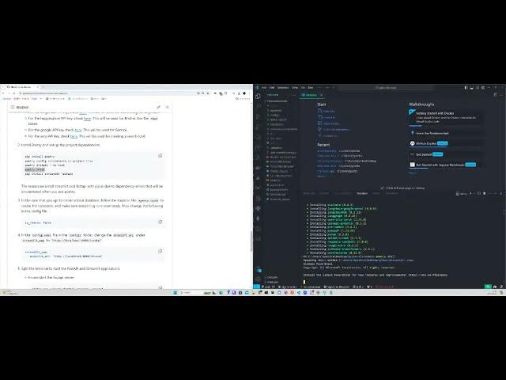

# Price Discovery

This repo contains the code and the implementation of the product discovery project.

## Introduction

The Price Discovery project harnesses the power of FastAPI, Streamlit, a Visual Large Language Model (VLLM), and an agent to efficiently determine the price range of a product based on its image and text description. This project is designed to offer a user-friendly interface for precise and efficient product price discovery using state-of-the-art natural language processing techniques.


Here's how it works: Users input a product image and its description into the Streamlit app. Upon submission, a POST request is sent to the FastAPI app where the pipeline is initiated. The product image is analyzed by the visual VLLM to extract detailed information about the product. These details are then combined with the description to create a more comprehensive product overview.

Next, this enhanced description is passed to an agent equipped with three tools: searching the internet, searching image databases, and searching text databases. The agent conducts these searches to identify similar products and then determines a price range based on its findings and comparison to similar products. Once completed, the agent returns the price range along with the rationale behind it to the user.

For more information, see the [documentation](https://github.com/fellowship/price-discovery/tree/main/notion-documentation)

## Prerequisites

- Python 3.11
- Poetry (for dependency management)
- Docker (if running the project with Docker)

## Directory Structure

```plaintext

|-- appendix
    |-- clip_notebooks
    |-- data_preparation_notebooks
    |-- rag_notebooks

|-- configs
    |-- __init__.py
    |-- config.yaml

|-- data
    |-- db
    |-- images
    |-- text_data

|-- notebooks
    |-- agents_notebooks
        |-- agents.ipynb
        |-- evaluation_notebooks

|-- src
    |-- __init__.py
    |-- agents.py
    |-- db.py
    |-- prompts.py
    |-- tools.py
    |-- utils.py

|-- test_data
    |-- headphones.jpg
    |-- README_images

|-- notion-documentation
|-- demo-session
|-- poetry.lock
|-- .pre-commit-config.yaml
|-- pyproject.toml
|-- fastapi_app.py
|-- streamlit_app.py
|-- Dockerfile.fastapi
|-- Dockerfile.streamlit
|-- docker-compose.yml
|-- Makefile
|-- README.md
```

NOTE: The `data` folder will not be present in the repo. The structure above showcases the structure of the data folder used during experimentation.

The `appendix` folder cotntains other notebooks used for experimentation on various architectures throughout the project.

The `notebooks` directory houses the main notebooks utilized for experimentation with the agents and throughout the project's development. It comprises several subdirectories:

- The `agents_notebooks` directory holds notebooks essential for constructing and assessing the agent. Here resides the core code of the project. The `agents.ipynb` notebook encompasses the main code responsible for building the agent, while `evaluation_notebooks` folder hosts the code showcasing evaluating the agent's performance.

The `notion-documentation` folder contains the documentation of the project.

The `demo-session folder` contains the presentations made on the project.

The `configs` folder contains the `config.yaml` file wich contains the configuration settings.

The `src` folder contains the modularized code from the notebook `agents.ipynb`.

the `test_data` folder contains the test image that can be used to experiment with the streamlit app.

The `fastapi_app.py`  contains the FastApi app code.

The `streamlit_app.py` contains the streamlit app code.

The `Dockerfile.streamlit` and `Dockerfile.compose` contains the Dockerfiles used to build the Docker images for the streamlit app and the FastApi app.

The `docker-compose.yml` is the configuration file used by Docker Compose to define and manage the streamlit and fastapi containers

The `Makefile` contains the instructions to run the project.

## Data implementation

**Option 1: Using our Remote Database**

You can request access to a pre-existing remote database by contacting our [colleague](yunmokoo7@gmail.com). If granted access, you can use the provided API key to connect to the database.

**Option 2: Create your own Remote Database**

Follow these steps as showcased [here](https://python.langchain.com/docs/integrations/vectorstores/qdrant). They are detailed below:

1. Create an account on Qdrant, navigate to qdrant [cloud](https://qdrant.to/cloud) and create a cluster. This is free and you will get an `api_key` and the `url` to access the cluster.

2. Instantiate qdrant:
    ```python
    import qdrant_client
    from langchain.vectorstores import Qdrant

    client = qdrant_client.QdrantClient(
    "<qdrant-url>",
    api_key="<qdrant-api-key>"
    )

    text_db = Qdrant(
        client=client, collection_name="apparel-collection",
        embeddings=embeddings,
    )

    image_db = Qdrant(
        client=client, collection_name="img-collection",
        embeddings=embeddings,
    )

    ```

3. Add data to your database:
    ```python
    # Import the CSVLoader and Directory Loader
    from langchain_community.document_loaders.csv_loader import CSVLoader
    from langchain_community.document_loaders import DirectoryLoader

    # Load data
    text_loader = CSVLoader(file_path="./example_data.csv")

    text_data = text_loader.load()

    image_loader = DirectoryLoader('folder_with_images', glob="**/*.jpg", show_progress=True)
    image_data = loader.load()

    # Add data to db
    text_db.add_documents(text_data)
    images_db.add_images(image_data)
    ```

4. Change the `url` under `vector_database` in the `config.yaml`. Ensure that `is_remote` is `True` and place the `VECTORSTORE_API_KEY` in your `.env` file.

5. Run the streamlit and fastapi apps.


**Option 3: Creating a Local Database**

To create your own local database, follow the instructions in the `agents.ipynb` notebook:

1. You can use the preprocessed datasets of size 20k or 50k which can be found [here](https://drive.google.com/drive/folders/17C-s4r774ons6z3CtCDsh8jH47p4_4PK?usp=sharing). It contains the text data which is csv format as well as the extracted images. Save the images folder and csv data in a `data` folder and follow the steps as shown on the notebook. These steps will include how to create a local database for yourself.

    **NOTE**: The preprocessed dataset should be moved to Fellowship.ai local machines or drive by **01/05/2024**


2. (Optional)

    - Get the original data from: [Amazon Products Dataset 2023 (1.4M Products)](https://www.kaggle.com/datasets/asaniczka/amazon-products-dataset-2023-1-4m-products?select=amazon_products.csv)
    - There are two csv files in the dataset: amazon_products.csv (the main dataset) and amazon_categories.csv (description of each categories)
    - Download both files into your local machine
    - Prepare the data using the data preparation script `get_apparel_data.ipynb` which can be found in the `data_preparation_notebooks` folderm in the appendix.

    - This script first filter a particular number of products from each specified category from the main dataset. In this case, the script is choosing 5000 products from each of the ten apparel category, which results in sample dataset of 50000 products.
    - Then the image of each product is downloaded (it will take a long time, so downloading them in batch may be useful)
    - Finally, we can choose to shuffle the dataset, choose which columns to keep, or split it into training or testing set. In this case, the list of columns is ```['asin', 'title', 'imgName', 'price', 'category_id', 'imgUrl', 'productURL']```

    - Running the `get_apparel_data.ipynb` script to filter and preprocess the data.


To create the local database:

1. Instantiate the database:
    ```python
    # Instantiate DB
    text_db = Chroma(persist_directory=db_dir,
    embedding_function=embedding_model,
    collection_name="apparel-collection")

    images_db = Chroma(persist_directory=db_dir,
     embedding_function=embedding_model,
     collection_name="img-collection")
    ```

2. Add data to DB as shown in the `Option 2: Create your own Remote Database` part.

## Usage

To implement the project, first clone the repo, then:

### Option 1: Without Docker

1. Create a .env file in the project root directory and populate it with the required API keys and tokens as shown below:

    ```plaintext
    LANGCHAIN_API_KEY="your_langchain_api_key"
    LANGCHAIN_PROJECT="price-discovery"
    LANGCHAIN_TRACING_V2="true"
    HUGGINGFACEHUB_API_TOKEN="your_huggingfacehub_api_token"
    GOOGLE_API_KEY="your_google_api_key"
    SERPAPI_API_KEY="your_serpapi_api_key"
    (ONLY WHEN USING REMOTE DB)VECTORSTORE_API_KEY="your_vectorstore_api_key"
    ```

    - For the vectorstore api key, request for access as stipulated in the data implementation section. Unless you opt to go for the local database, you won't need it.
    - For the langchain API key, check [here](https://docs.smith.langchain.com/setup). This will be used for monitoring on langsmith.
    - For the huggingface API key, check [here](https://huggingface.co/docs/api-inference/en/quicktour#get-your-api-token). This will be used for Mistral. Use the `read` token.
    - For the google API key check [here](https://aistudio.google.com/app/prompts/new_chat/?utm_source=agd&utm_medium=referral&utm_campaign=core-cta&utm_content=). This will be used for Gemini.
    - For the serp API key check [here](https://serpapi.com/). This will be used for creating a search tool.

2. Install Poetry and set up the project dependencies:

     ```bash
    pip install poetry
    poetry config virtualenvs.in-project true
    poetry install --no-root
    poetry shell
    pip install streamlit fastapi
    ```

    The reason we install streamlit and fastapi with pip is due to dependency errors that will be encountered when you use poetry.

3. In the case that you opt to create a local database, follow the steps on the `agents.ipynb` to create the notebook, and make sure everything runs seamlessly. Also, change the following in the config file:

    ```yaml
    is_remote: False
    ```

4. In the `config.yaml` file in the `configs` folder, change the `endpoint_url` under `streamlit_app` to `"http://localhost:8000/invoke"`.

     ```yaml
    streamlit_app:
        endpoint_url: "http://localhost:8000/invoke"
    ```

5. Split the terminal to start the FastAPI and Streamlit applications.

    - In one start the fastapi server:

        ```bash
      poetry run uvicorn fastapi_app:app --reload
      ```

    - In the second one start the streamlit app:

        ```bash
      poetry run streamlit run streamlit_app.py
      ```

6. Access the applications via the urls provided once the startup is complete.

7. Upload product image and product description via the streamlit app  and view results.

### Option 2: With Docker

1. Create a .env file in the project root directory and populate it with the required API keys and tokens (same as in Option 1).

2. In the `config.yaml` file in the `configs` folder, change the `endpoint_url` under `streamlit_app` to `"http://fastapi:8000/invoke"`. This allows the Streamlit app to communicate with the FastAPI app running in the Docker container.

    ```yaml
    streamlit_app:
        endpoint_url: "http://fastapi:8000/invoke"
    ```

3. Change the name `repo` in the `docker-compose.yml` to your own repo name in docker.

4. Build up the Docker images:

     ```bash
    make build
    ```

    The `make build` command builds the Docker images for the project.

5. Run the Docker image:

    ```bash
    make run
    ```

    The `make run` command starts the Docker container and maps the necessary ports for the FastAPI and Streamlit applications.

6. Access the applications:
    - FastAPI app: <http://localhost:8000>

    - Streamlit app: <http://localhost:8501>

7. Upload product image and product description via the streamlit app and view results.

8. Clean up after.

    ```bash
    make stop

    make clean

## Usage Video


[](https://www.youtube.com/watch?v=TfCGnAkiQgU)

**DISCLAIMER:** The video might be hazy on some parts, but it should help you navigate the usage section and get started.

## Getting Help

For inquiries, please refer to `GETTINGHELP.md`
